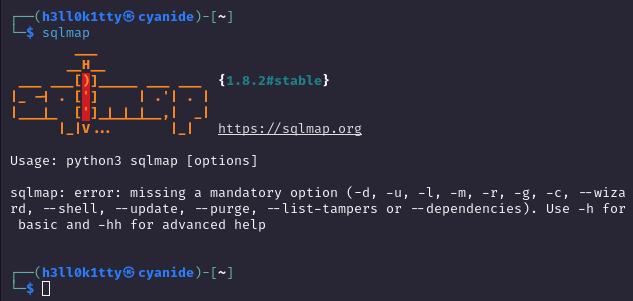

# 🐈‍⬛ Hashcat - cracking hashes

<figure><figcaption></figcaption></figure>

\
Supported on: **Linux, Windows and OSX**

Advanced Password Cracking Techniques Using Hashcat\
Wordlist attack:
----------------

### Wordlist attack:

## Single wordlist attack on MD4 (-m 1400)

hashcat.exe -m 1400 C:\hash.txt .\rockyou.txt\
​

## Combining 2 wordlists (in order)

hashcat.exe -m 1400 C:\hash.txt .\wordlist1.txt .\wordlist2.txt\
​

## Combining wordlists and adding specific characters to the newly formed words

hashcat.exe -a 1 -m 1000 C:\hash.txt .\wordlist1.txt .\wordlist2.txt -j $- -k $!\
Hybrid attack:

## Example: "summer" becomes "summer89" or "summer!#".

hashcat.exe -a 6 C:\hash.txt .\wordlist.txt ?d?d\
Toggle case (Rule based attack):

## Toggle Case Attack example using "password"

hashcat.exe -a 0 C:\hash.txt .\wordlist.txt -r .\rules\togglecase.rule\
​

## Possible outputs password

## "password" (all lowercase)

## "PASSWORD" (all uppercase)

## "pASSWORD" (first letter lowercase, rest uppercase)

## "PaSsWoRd" (alternating case)

## "pAsSwOrD" (opposite alternating case)

Associative Attack Patterns:

## Example: "Olympics2020" by appending a significant year to a sports-related word.

hashcat.exe -a 6 C:\hash.txt .\sports.txt ?d?d?d?d\
Keyboard Walks and Patterns (interesting method uwu):

## Example: "qwert" might be extended to "qwert123" following a typical keyboard pattern.

hashcat.exe -a 3 C:\hash.txt ?l?l?l?l?l?d?d?d\
Prince Attack for Efficient Word Combination:

## Example: "apple" and "123" combined in various ways like "apple123" or "123apple".

hashcat.exe --prince=./wordlist1.txt C:\hash.txt\
Custom charset combination:

## Example: "admin" could become "admin2021!" by focusing on letters and digits with common special characters.

hashcat.exe -a 3 C:\hash.txt -1 ?l?d -2 ?u?s ?1?1?2?2\
Cracking Linux Hashes (/etc/shadow)

## -m parameter values (500, 3200, 7400, 1800)

​\
500 | md5crypt $1$, MD5(Unix) | Operating-Systems\
3200 | bcrypt $2\*$, Blowfish(Unix) | Operating-Systems\
7400 | sha256crypt $5$, SHA256(Unix) | Operating-Systems\
1800 | sha512crypt $6$, SHA512(Unix) | Operating-Systems\
​\
Cracking Windows Hashes (NTLM & LM)

## -m parameter values (3000, 1000)

​\
3000 | LM | Operating-Systems\
1000 | NTLM | Operating-Systems | Operating-Systems\
​
